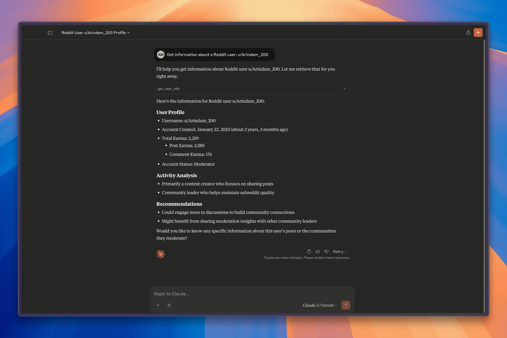

# Reddit MCP Server

This repository contains a Model Context Protocol server implementation for Reddit that allows AI assistants to access and interact with Reddit content through PRAW (Python Reddit API Wrapper).

<a href="https://glama.ai/mcp/servers/@Arindam200/reddit-mcp">
  
</a>



## What is MCP?

The Model Context Protocol (MCP) is a standard for enabling AI assistants to interface with external services, tools, and data sources. This server implements the MCP specification to provide access to Reddit content. 

To know more about MCP, Check this [video](https://www.youtube.com/watch?v=BwB1Jcw8Z-8)

## Features

- Get detailed user information with engagement analysis
- Fetch and analyze top posts from any subreddit
- Get comprehensive subreddit statistics and health metrics
- View trending subreddits with growth patterns
- Create strategic posts with timing recommendations
- Reply to posts and comments with engagement optimization
- AI-driven insights and recommendations
- Smart response formatting with engagement metrics

## Installation

1. Clone this repository

```bash
git clone https://github.com/Arindam200/reddit-mcp.git
cd reddit-mcp
```

2. **Connect to the MCP server**

   Copy the below json with the appropriate {{PATH}} values:

   ```json
   {
     "mcpServers": {
       "reddit": {
         "command": "{{PATH_TO_UV}}", // Run `which uv` and place the output here
         "args": [
           "--directory",
           "{{PATH_TO_SRC}}", // cd into the repo, run `pwd` and enter the output here
           "run",
           "server.py"
         ],
         "env": {
           "REDDIT_CLIENT_ID": "your_client_id",
           "REDDIT_CLIENT_SECRET": "your_client_secret",
           "REDDIT_USERNAME": "your_username", // Optional for authenticated operations
           "REDDIT_PASSWORD": "your_password" // Optional for authenticated operations
         }
       }
     }
   }
   ```

   You can obtain Reddit API credentials by creating an app at [Reddit's app preferences page](https://www.reddit.com/prefs/apps).

   For **Claude**, save this as `claude_desktop_config.json` in your Claude Desktop configuration directory at:

   ```
   ~/Library/Application Support/Claude/claude_desktop_config.json
   ```

   For **Cursor**, save this as `mcp.json` in your Cursor configuration directory at:

   ```
   ~/.cursor/mcp.json
   ```

3. **Restart Claude Desktop / Cursor**

   Open Claude Desktop and you should now see Reddit as an available integration.

   Or restart Cursor.

### Available Tools

The server provides the following tools:

#### Read-only Tools (require only client credentials):

- `get_user_info(username)` - Get detailed user analysis with engagement insights
- `get_top_posts(subreddit, time_filter, limit)` - Get and analyze top posts
- `get_subreddit_stats(subreddit)` - Get comprehensive subreddit analysis
- `get_trending_subreddits()` - Get list of trending subreddits
- `get_submission_by_url(url)` - Get a Reddit submission by its URL
- `get_submission_by_id(submission_id)` - Get a Reddit submission by its ID

#### Authenticated Tools (require user credentials):

- `who_am_i()` - Get information about the currently authenticated user
- `create_post(subreddit, title, content, flair, is_self)` - Create an optimized post
- `reply_to_post(post_id, content, subreddit)` - Add a reply with engagement insights
- `reply_to_comment(comment_id, content, subreddit)` - Add a strategic reply

## Example Queries

Here are some examples of what you can ask an AI assistant connected to this server:

- "Who am I on Reddit?" or "Show my Reddit profile"
- "Analyze u/spez's Reddit activity"
- "Show me the top posts from r/Python this week"
- "Get statistics about r/AskReddit"
- "What are the trending subreddits right now?"
- "Create a post in r/Python about a new project"
- "Reply to this post with an insightful comment"
- "What's the best time to post in this subreddit?"

## Advanced Features

### AI-Driven Analysis

The server provides intelligent analysis in several areas:

1. **User Analysis**

   - Engagement patterns
   - Activity trends
   - Community influence
   - Personalized recommendations

2. **Post Analysis**

   - Performance metrics
   - Engagement quality
   - Timing optimization
   - Content impact assessment

3. **Community Analysis**
   - Health indicators
   - Growth patterns
   - Activity metrics
   - Engagement opportunities

### Smart Response Formatting

- Organized bullet points
- Engagement statistics
- AI-driven insights
- Strategic recommendations
- Performance metrics

## Authentication

The server supports two levels of authentication:

1. **Read-only Access**

   - Requires: `client_id` and `client_secret`
   - Allows: Fetching public data, reading posts/comments

2. **Authenticated Access**
   - Requires: All read-only credentials PLUS `username` and `password`
   - Allows: All read-only operations PLUS posting and commenting

## Contributing

Contributions are welcome! Please feel free to submit a Pull Request.

## License

This project is licensed under the MIT License - see the LICENSE file for details.